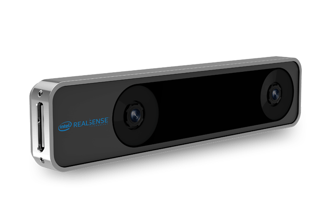

# Autonomous drone

## 1. DESCRIPTON
FC로 Pixhawk4 mini를 사용하고 on board computer로 jetson nano, intel realsense t265, pi camera를 사용해 실내 자율비행이 가능하게 한 쿼드콥터 프로젝트이다 
펌웨어는 px4, 착륙점 탐지를 위해 Opencv를 사용하고 전체 시스템 구성은 ROS로 개발하였다.

## 2. HARDWARE CONFIGURATION
### 1) DRONE SWARM SET I: DRONE BIULT FROM SCRATCH BASED ON Q250 FRAME AND PIXHAWK4 MINI AUTOPILOT
#### a) MECHANICAL SYSTEM
Q250 프레임을 기반으로 제작하였다
mechanical system:

```
- UAV Type: QuadCopter
- Frame Size: Q250
- Motors: 2450 kV
- Propellers: 5.0 x 3.0 counterclockwise (2),
              5.0 x 3.0 clockwise (2)
- Battery: 3S 3.0 Ah 60C lithium polymer
```

<p align="center">
  
</p>

#### b) Flight controller
Pixhawk4 mini를 사용하였고 펌웨어는 px4를 사용하였다
```
- Autopilot: Pixhawk 4 mini
- Firmware: px4 v2.0
```

<p align="center">

</p>

#### c) POSITIONING SYSTEM
실내 위치 추정을 위해 Intel Realsense T265를 사용하였다
```
- Tracking camera: Intel® RealSense™ Tracking Camera T265
```

<p align="center">

</p>

#### d) ON BOARD COMPUTING SYSTEM (COMPANION COMPUTER)
Perception, Localization, Computer vision 등에 높은 컴퓨팅 파워가 필요하기 떄문에 Nvidia Jetson nano를 ON BOARD COMPUTER로 사용하였다
```
- Single Board Computer: Nvida Jetson nano board
- Processor: Quad-core ARM® Cortex-A57 @ 1.43 GHz
- Memory: 2 GB 64-bit LPDDR4 25.6 GB/s
- GPU : 128-core Maxwell
- Storage Capacity: microSD
- OS: JetPack 4.5.1
```

<p align="center">
  
</p>

#### e) VISION CAMERA 
Opencv를 통한 Computer vision 구현을 위해 Rasberry pi fish eye lens camera를 사용하였다

<p align="center">

</p>

#### f) COMMUNICATION SYSTEM
Jetson nano에는 기본적으로 무선랜카드가 미장착 되어있기 떄문에 Iptime usb lan card를 장착하였고
Manual control을 위해 Taranis x7 조종기를 사용하였다
```
- Communication with Companion Computer: Telem1 to serial pin
- Communication with pc : Wifi
- Manual Control: RC radio 
```
<p align="center">
 
</p>
<p align="center">
Iptime Wireless LAN Card (left) and rc radio transmitter Tranis X7 (right)
</p>

#### g) FINAL PRODUCT

<p align="center">
  
</p>
